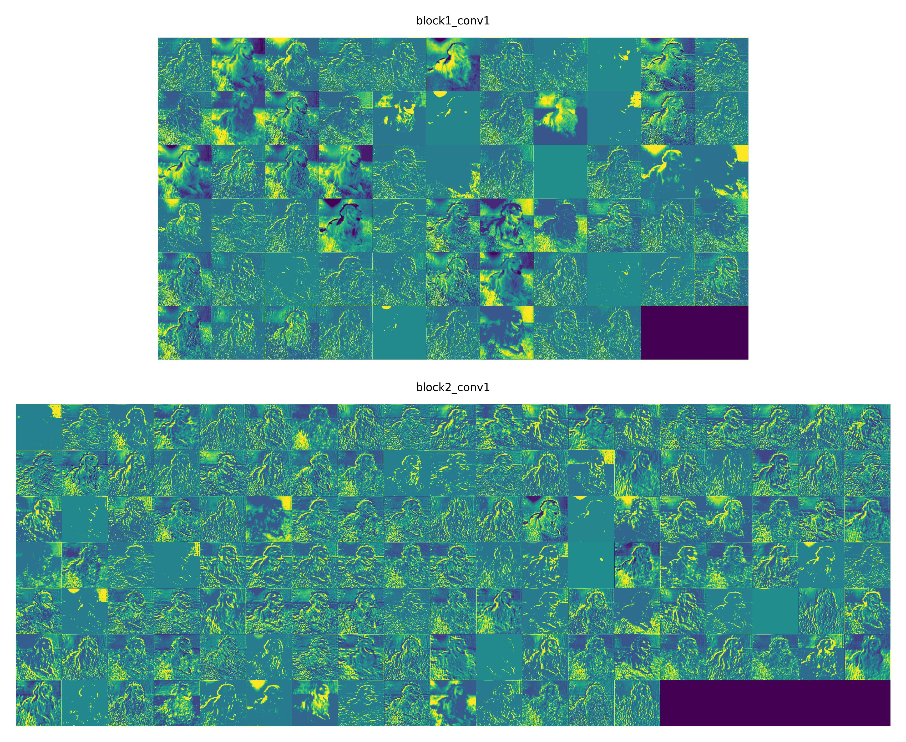

<div id="top"></div>

<!-- PROJECT SHIELDS -->
[![Contributors][contributors-shield]][contributors-url]
[![Forks][forks-shield]][forks-url]
[![Stargazers][stars-shield]][stars-url]
[![Issues][issues-shield]][issues-url]
[![MIT License][license-shield]][license-url]


<!-- PROJECT LOGO -->
<br />
<div align="center">
    
    <h3 align="center">Keras CNN Visualizer</h3>
    <p align="center">
        Tensorflow2 Keras CNN feature maps visualization
        <br />
        <a href="https://github.com/SteinsFu/keras-cnn-visualizer/issues">Report Bug</a>
        ·
        <a href="https://github.com/SteinsFu/keras-cnn-visualizer/issues">Request Feature</a>
    </p>
</div>


<!-- TABLE OF CONTENTS -->
<details>
    <summary>Table of Contents</summary>
    <ol>
        <li><a href="#about-the-project">About The Project</a></li>
        <li><a href="#installation">Installation</a></li>
        <li>
            <a href="#usage">Usage</a>
            <ul>
                <li><a href="#examples">Examples</a></li>
                <li><a href="#visualization">Visualization</a></li>
            </ul>
        </li>
        <li><a href="#contributing">Contributing</a></li>
        <li><a href="#license">License</a></li>
        <li>
            <a href="#acknowledgments">Acknowledgments</a>
            <ul>
                <li><a href="#references">References</a></li>
            </ul>
        </li>
    </ol>
</details>


<!-- ABOUT THE PROJECT -->
## About The Project

This project aims to visualize the internal feature maps for any Keras models (Tensorflow 2)

<p align="right">(<a href="#top">back to top</a>)</p>


<!-- INSTALLATION -->
## Installation
```bash
pip install -r requirements.txt
```

If you are using Anaconda, please check the [corresponding CUDA & cuDNN versions for TF](https://www.tensorflow.org/install/source#tested_build_configurations) and install them accordingly:
```bash
conda search cudatoolkit
conda search cudnn
conda install cudatoolkit=<cuda_version>
conda install cudnn=<cudnn_version>
```

<p align="right">(<a href="#top">back to top</a>)</p>


<!-- USAGE -->
## Usage

```bash
python visualize.py [OPTIONS]
```

| Options                | Usage                                                                | Default          |
|------------------------|----------------------------------------------------------------------|------------------|
| `-m` / `--model_path`  | Model path                                                           | Use Keras VGG16  |
| `-l` / `--layer_names` | List of layer names for visualization (e.g. layer_1 layer_2 layer_3) | `[]`             |
| `-i` / `--input_dir`   | Directory for input images                                           | `examples/`      |
| `-o` / `--output_dir`  | Directory for output visualization images                            | `visualization/` |
| `--dpi`                | DPI of output visualization images                                   | 600              |

### Examples

Visualize layers of vgg16: `block1_conv1` `block2_conv1` `block3_conv1` `block4_conv1` `block5_conv1`:
```bash
python visualize.py -l block1_conv1 block2_conv1 block3_conv1 block4_conv1 block5_conv1
```

Visualize your own model:
```bash
python visualize.py -m path/to/your_model.h5 -l layer1 layer2 layer3
```

### Visualization
The followings are the examples of `python visualize.py -l block1_conv1 block2_conv1`
| Input                                         | Visualization                                           |
|-----------------------------------------------|---------------------------------------------------------|
|  |  |
|  |  |

<p align="right">(<a href="#top">back to top</a>)</p>


<!-- CONTRIBUTING -->
## Contributing

Contributions are what make the open source community such an amazing place to learn, inspire, and create. Any contributions you make are **greatly appreciated**.

If you have a suggestion that would make this better, please fork the repo and create a pull request. You can also simply open an issue with the tag "enhancement".

1. Fork the Project
2. Create your Feature Branch (`git checkout -b feature/AmazingFeature`)
3. Commit your Changes (`git commit -m 'Add some AmazingFeature'`)
4. Push to the Branch (`git push origin feature/AmazingFeature`)
5. Open a Pull Request

<p align="right">(<a href="#top">back to top</a>)</p>


<!-- LICENSE -->
## License

Distributed under the MIT License. See [LICENSE](LICENSE) for more information.

<p align="right">(<a href="#top">back to top</a>)</p>


<!-- ACKNOWLEDGMENTS -->
## Acknowledgments
This readme doc is modified from [Best-README-Template](https://github.com/othneildrew/Best-README-Template)

### References
1. [Tutorial — How to visualize Feature Maps directly from CNN layers](https://www.analyticsvidhya.com/blog/2020/11/tutorial-how-to-visualize-feature-maps-directly-from-cnn-layers/)
2. [Guide to Visualize Filters and Feature Maps in CNN](https://www.kaggle.com/code/arpitjain007/guide-to-visualize-filters-and-feature-maps-in-cnn)

<p align="right">(<a href="#top">back to top</a>)</p>


<!-- MARKDOWN LINKS & IMAGES -->
<!-- https://www.markdownguide.org/basic-syntax/#reference-style-links -->
[contributors-shield]: https://img.shields.io/github/contributors/SteinsFu/keras-cnn-visualizer.svg?style=for-the-badge
[contributors-url]: https://github.com/SteinsFu/keras-cnn-visualizer/graphs/contributors
[forks-shield]: https://img.shields.io/github/forks/SteinsFu/keras-cnn-visualizer.svg?style=for-the-badge
[forks-url]: https://github.com/SteinsFu/keras-cnn-visualizer/network/members
[stars-shield]: https://img.shields.io/github/stars/SteinsFu/keras-cnn-visualizer.svg?style=for-the-badge
[stars-url]: https://github.com/SteinsFu/keras-cnn-visualizer/stargazers
[issues-shield]: https://img.shields.io/github/issues/SteinsFu/keras-cnn-visualizer.svg?style=for-the-badge
[issues-url]: https://github.com/SteinsFu/keras-cnn-visualizer/issues
[license-shield]: https://img.shields.io/github/license/SteinsFu/keras-cnn-visualizer.svg?style=for-the-badge
[license-url]: https://github.com/SteinsFu/keras-cnn-visualizer/blob/master/LICENSE.txt
